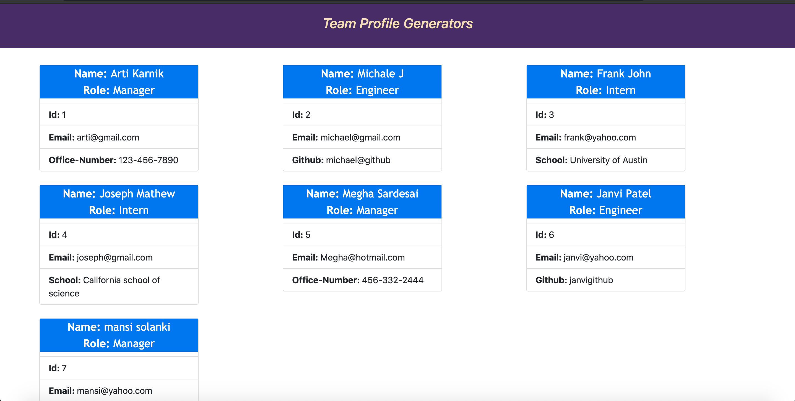
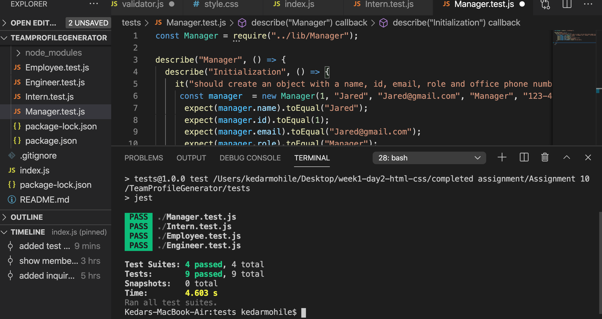
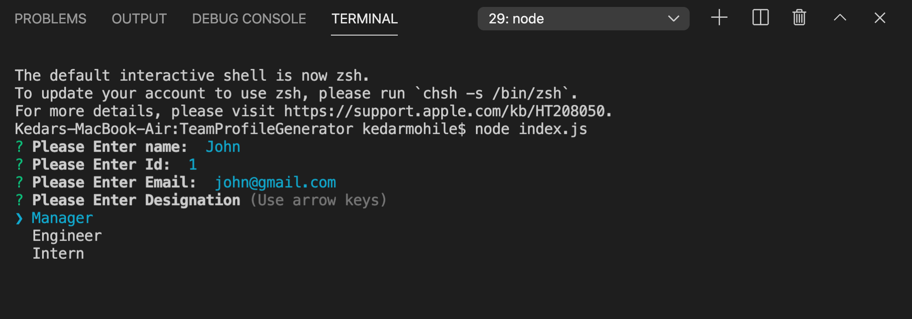

# TeamProfileGenerator

<strong> Project Summary: </strong>  
Build an application which implements Node.js command-line application to take Employee information like Name, Id, Role, school, email and Phone number. 
Based on information provided that takes in information, application then generates an HTML webpage that displays information for each employee.  
Along with this, unit test are added for each part of code and ensure that it passes. Test cases are automated and run with Jest.
 
https://drive.google.com/file/d/1WqEmenJRO8G7jjCOMQUubo7erVyA1kwz/view

      
      
      
      

 
<strong> Code Installation: </strong>  
$ cd [path_to_save_codebase]  
$ git clone https://github.com/arti-karnik/Javascript-Quizzy  
$ npm i 
$ node index.js 
to run test cases type npm t

<strong> Github Profile: </strong>  

<strong> Code-base: </strong>  
https://github.com/arti-karnik/TeamProfileGenerator

Application walk-through video: 
https://drive.google.com/file/d/1WqEmenJRO8G7jjCOMQUubo7erVyA1kwz/view

